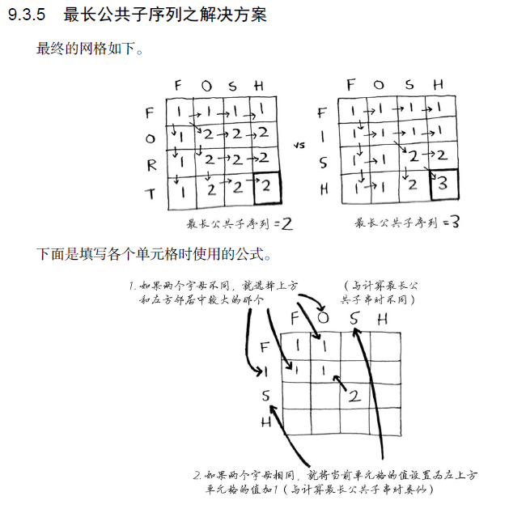

# 算法图解-python

> 本书观后感受：建议速读，本书运用实际事例举例讲解各种算法逻辑。推荐没有数据结构经验的同学阅读。

## 内容概览
### 数组和链表

| Command | 数组 | 链表 |
| ---     | ---  | ---  |
| 读取    | O(1) | O(n) |
| 输入    | O(n) | O(1) |

- 数组先创建固定内存，因此可以快速查找指定index
- 链表每个元素指向下一个内存，因此插入更快，读取要从头读到尾

### 选择排序

循环遍历选择最大的数(O(n)),选择n次。需要的时间为$$O(n \times n) = O(n^{2})$$
```
def findSmallest(arr):
    smallest = arr[0]           // 存储最小的值
    smallest_index = 0          // 存储最小元素的索引
    for i in range(1, len(arr)):
        if arr[i] < smallest:
            smallest = arr[i]
            smallest_index = i
    return smallest_index

def selectionSort(arr):         // 对数组进行排序
    newArr = []
    for i in range(len(arr)):
        smallest = findSmallest(arr)    // 找出最小的元素加入到新数组
        newArr.append(arr.pop(smallest))
    return newArr

print selectionSort([5, 3, 6, 2, 10])
```

### 递归

递归函数由两部分构成：
- 基线条件
- 递归条件

```
def countdown(i):
    print i
    if i <= 0:      // 基线条件
        return
    else:           // 递归条件
        countdown(i-1)
```

### 快速排序

```
def quicksort(array):
    if len(array) < 2:
        return array        // 基线条件
    else:
        pivot = array[0]    // 递归条件
        less = [i for i in array[1:] if i <= pivot]//由所有小于基准的元素组成子数组
        greater = [i for i in array[1:] if i > pivot]//由所有大于基准的元素组成子数组
        return quicksort(less) + [pivot] + quicksort(greater)
print quicksort([10, 5, 2, 3])
```

### 散列表

| Command | 数组 | 链表  | 散列表（平均情况） | 散列表（最糟情况） |
| ---     | ---  | ---  | ---  | ---  |
| 读取    | O(1) | O(n) | O(1) | O(n) | 
| 输入    | O(n) | O(1) | O(1) | O(n) | 
| 删除    | O(n) | O(1) | O(1) | O(n) |

散列表的性能受装填因子影响：
$$
装填因子 = \frac{散列表包含的元素数}{位置总数}
$$

填装因子越低，发生冲突的可能性越小，散列表的性能越高。一个不错的经验规则是：一旦填装因子大于0.7，就调整散列表的长度。

### 广度优先搜索

广度优先搜索是一种用于图的查找算法，可帮助回答两类问题。
- 第一类问题：从节点A出发，有前往节点B的路径吗？
- 第二类问题：从节点A出发，前往节点B的哪条路径最短？(段数最少的路径)

```
def person_is_seller(name):
    return name[-1] == 'm'
    // 这个函数检查人的姓名是否以m结尾：如果是，他就是芒果销售商。

def search(name):
    search_queue = deque()
    search_queue += graph[name]
    searched = []       // 这个数组用于记录检查过的人
    while search_queue:
        person = search_queue.popleft()
        if not person in searched:      // 仅当这个人没检查过的时候才检查
            if person_is_seller(person):
                print person + " is a mango seller!"
                return True
            else:
                search_queue += graph[person]
                searched.append(person) // 将这个人标记为检查过
    return False
search("you")
```

### 狄克斯特拉算法（Dijkstra’s algorithm）

如果线段有数，且数据当且仅当为非负数据，可以使用Dijkstra’s algorithm. 它包含四个步骤：
- 找出最便宜的节点，即可在最短时间内前往的节点。
- 对于该节点的邻居，检查是否有前往它们的更短路径，如果有，就更新其开销。
- 重复这个过程，直到对图中的每个节点都这样做了。
- 计算最终路径

该问题实习需要三个散列表：
- graph 包含所有点之间的开销
- costs 包含当前节点的cost
- parents 包含父节点的散列表

```
node = find_lowest_cost_node(costs)     // 在未处理的节点中找开销最小的节点
while node is not None:                 // 这个while循环在所有节点都被处理之后结束
    cost = costs[node]
    neighbors = graph[node]
    for n in neighbors.keys():          // 遍历当前节点的所有邻居
        new_cost = cost + neighbors[n]  
        if costs[n] > new_cost:         // 如果经过当前节点前往该邻居更近
            costs[n] = new_cost         // 更新该邻居开销
            parents[n] = node           // 同时将该邻居的父节点设置为当前节点
    processed.append(node)              // 将当前节点标为处理过
    node = find_lowest_cost_node(costs) // 找出接下来要处理的节点，并循环

def find_lowest_cost_node(costs):
    lowest_cost = float("inf")
    lowest_cost_node = None
    for node in costs:                  // 遍历所有节点
        cost = costs[node]
        if cost < lowest_cost and node not in processed: // 如果当前节点开销更低，且未处理过
            lowest_cost = cost          // 将其视为开销最低的节点
            lowest_cost_node = node
    return lowest_cost_node
```

### 贪婪算法

可以解决背包问题以及排课问题，每一步都选择最优解

```
while states_needed:
    best_station = None
    states_covered = set()
    for station, states in stations.items():
        covered = states_needed & states
        if len(covered) > len(states_covered):
            best_station = station
            states_covered = covered

states_needed -= states_covered
final_stations.add(best_station)
```

### 动态规划


```
if word_a[i] == word_b[j]:      // 两个字母相同
    cell[i][j] = cell[i-1][j-1] + 1
else:                           // 两个字母不同
    cell[i][j] = max(cell[i-1][j], cell[i][j-1])
```